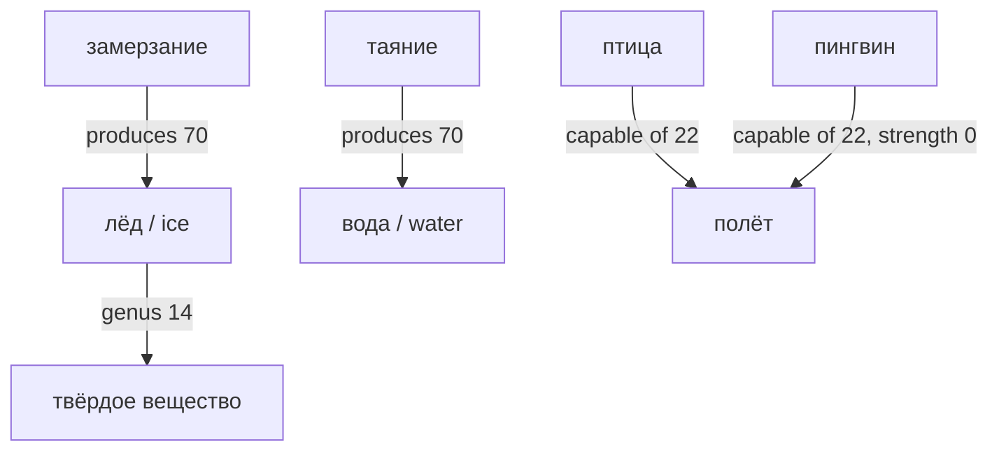

# conceptuum

**A graph of logical relations between concepts** — not a word list, not a document dump, not “a database with terms in it.”

MariaDB holds the bytes. What you *work with* is a **directed labeled graph**:

- a **node** is a *meaning* (лёд / ice / 氷 are one node; environment-среда and Wednesday-среда are two);
- an **edge** is a *typed logical link* — genus, essential attribute, cause, contrary, purpose — with a grammar that rejects category mistakes.



Walk the graph: up the genus chain, down to species, sideways to opposites and causes. Definitions are not prose someone wrote — they are **read off the edges** (*genus + differentia*).

> Русскоязычным: это **граф логических связей понятий** (род–вид, признак, причина, противоположность), а не таблица слов. Слово — ярлык; узел — смысл.

**Topics / who this is for:** `knowledge-graph` · `ontology` · `concept-graph` · `semantic-network` · `neuro-symbolic` · `symbolic-ai` · `llm-grounding` · `rag` · `knowledge-representation` · `formal-logic` · `taxonomy` · `dag` · `genus-differentia`

---

## Thirty seconds

| This is | This is not |
|---|---|
| A **knowledge graph** of concepts and *logical* relations | A dictionary, thesaurus, or Wikipedia dump |
| One node per **meaning** (synonyms share a node) | One row per word form |
| Typed edges with a **relation grammar** | Free-text “related to” links |
| A DAG of genera (a concept may have two classifications) | A single-parent folder tree |
| Grounding for small LLMs: verify / define from the graph | A chatbot that “knows” the domain from weights |

Classical rule, encoded as data: **definiendum = nearest genus + specific properties**; species listed extra. The `defin` column is *derived* — fix edges, never the sentence.

## Look at the graph

Visualizer (`visualizer/`): search ru/en, language from the browser locale, click a concept → genera **above** (DAG), species **below**, card with generated definition and typed relations.

```bash
cd visualizer
go run .          # http://localhost:7100/
# DSN: JNANA_DSN or root:123@tcp(127.0.0.1:3306)/jnana3
```

```python
from jnana_engine import JnanaEngine
eng = JnanaEngine(pref_lang="en")
eng.verify("ice", "freezing")
# ('yes', 'ice <-[causal (produces)] freezing', [])
eng.define()   # rebuilds concept.defin from the graph — not from prose
```

```bash
python ask.py "Why does water turn into ice?" --no-llm
```

## Load the dump

```sql
CREATE DATABASE jnana3 CHARACTER SET utf8mb4;
```

```bash
mysql -u root -p jnana3 < jnana3_dump.sql
```

Python 3.8+, `pymysql`, optional `pymorphy3` (Russian morphology). MariaDB/MySQL.

---

## The graph, not the tables

Storage is relational so the grammar can be *enforced*. The mental model is still a graph:

```
concept  ──terms──►  лёд, ice, Eis
    │
    ├──[14 genus]────────►  твёрдое вещество
    ├──[20 attribute 95%]─►  холодное
    └──[70 produced by]───►  замерзание
```

- **Universes** (everyday, scientific, IT, legal, logic) are *discourses*, not extra copies of the node. Two classifications of one meaning → two genus edges, `universum_id` on the edge.
- **Homonyms** (different meanings of one word) stay two nodes.
- **Word class does not pick the genus.** Infinitive and deverbal noun, adjective and noun, aspect pairs — one concept; forms live in `concept_term`.
- **Inheritance.** Attach a property at the highest genus that still holds; species override with strength `0` (пингвин does not fly).

Relation families (codes in table `relevant`):

| Family | Codes | Examples |
|---|---|---|
| Taxonomy | 14 | dog → mammal |
| Essential / specific properties | 15, 20–27 | ice — cold; bird — capable of flight; cup — porcelain |
| Compatibility | 30, 40, 60 | coextensive, overlap, incompatible |
| Opposition | 61–64 | co-hyponyms; buy/sell; hot/cold; true/false |
| Cause & time | 70–74 | produces, hinders, precedes, depends on |

Each type has a **signature** (allowed subject/object subtrees), symmetry, transitivity. `propose()` rejects illegal edges. Closure of genus is table `concept_path`.

Fill level `concept.processed`: **0** none · **1** genus and species · **2** essential/specific properties · **3** parallel (non-isa) relations. Not a lock.

Full rulebook: [docs/ontology-rules.md](docs/ontology-rules.md). Token-lean property filling: [docs/fill-properties.md](docs/fill-properties.md).

## Engine (`jnana_engine.py`)

`JnanaEngine`: `resolve` / `resolve_all` / `resolve_fuzzy`, `add_concept`, `add_genus`, `merge_concepts`, `verify`, `propose`, `rebuild`, `define`, `set_processed(cid, 0…3)`.

`pref_lang="en"` picks display terms (English `to …` is a term, not the label).

## LLM grounding

**Pay for a strong model once, at fill time.** Runtime is SQL over the graph: a small model (or no model) gets canonical definitions and checked relations instead of inventing them.

- `ask.py` — retrieve FACTS + one-hop RELATED, then optionally a local OpenAI-compatible endpoint.
- `interleave.py` — in-stream fact injection (experimental).

```bash
python ask.py "Что порождает юридическую ответственность?" \
    --endpoint http://localhost:8090/v1 --model local
```

> Кража — преступление. Преступление порождает наказание…  
> Melting produces water; drinking is directed at water — melted ice can be drunk.

## Schema (MariaDB)

| Table | Role in the graph |
|---|---|
| `concept` | Nodes (`dharma`, `nama`, cached `defin`, home `universum_id`, `processed` 0–3) |
| `concept_term` | Labels on nodes (ru / en / …) |
| `edge` | Typed arcs: `dh1 —[kod]→ dh2`, strength, status, source |
| `relevant` | Edge-type grammar (signatures, symmetry, transitivity) |
| `universum` | Discourses (everyday / scientific / IT / legal / logic) |
| `concept_path` | Transitive closure of genus (14) |

Relation code table, deprecated 8x→2x migration, and design notes (degree in `strength`, attach at genus, negation = 0) are in the sections below for implementers.

### Relation codes

| Code | Relation | Notes |
|---|---|---|
| 11 / 12 | universe / domain | discourse context |
| 14 | genus (is-a) | transitive; `concept_path` |
| 15 | essential attribute | differentia |
| 20 | attribute | degree in `edge.strength` 0–100 |
| 21 / 22 | purpose / capable of | artifact or organism → action/process |
| 23 | material | artifact → substance |
| 24 / 25 / 26 | content / application / user | |
| 27 | patient | action → object |
| 30 | coextensive | |
| 40 | overlap | symmetric; degree in `strength` |
| 60 | incompatible | |
| 61 | coordinate | symmetric co-hyponyms |
| 62 | converses | symmetric (buy/sell) |
| 63 / 64 | contrary / contradictory | symmetric |
| 70 / 71 | produces / hinders | |
| 72 / 73 | precedes / simultaneous | 73 symmetric |
| 74 | depends on | |

Deprecated: 10, 13, 41, 43, 45, 47, 48, 49, 80–83 (8x folded into 2x; old degree codes into `strength`).

### Design notes

- **Degree is data, not code.** Always / usually / rare → `edge.strength`.
- **part-of ≠ made-of.** Localized detachable part vs substrate of the whole.
- **Ternary facts are two binaries.** Purpose + patient; no ternary relation nodes.
- **Attach at the highest genus**; keep a species edge only if the object is more specific or strength differs by ~25+ points. `strength = 0` is explicit negation (пингвин —[22]→ полёт 0).
- **Terms do not rewrite the tree.** See [ontology-rules.md](docs/ontology-rules.md).

## Current snapshot

About **4560 concepts**, **6800 edges**, **20k** genus-paths. Universes: everyday (ru+en), IT (en-primary, ru terms), legal, logic.

Experimental. Auto-filled edges carry `source`; they are meant to be revised.

## License

MIT. Repo: [github.com/thpg/conceptuum](https://github.com/thpg/conceptuum).
