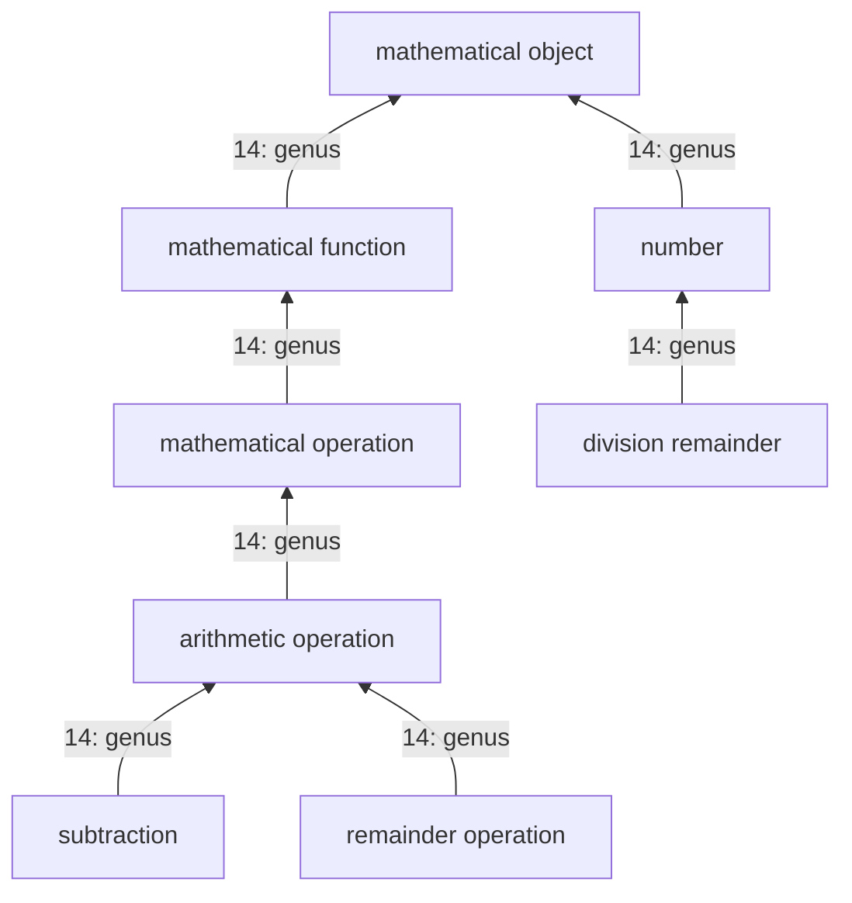

# conceptuum

A concept graph with typed relations, multilingual terms, and definitions generated from the graph.

conceptuum represents meanings as nodes and connects them through relations such as genus, purpose, material, opposition, and cause. It combines a MariaDB snapshot, a Python engine for querying and reviewing the graph, and a Go web visualizer. An optional retrieval demo supplies graph context to a local language model.

**Development version:** [0.1.0-dev](VERSION) · **Data snapshot:** [Q8, 2026-10-09](docs/quality/2026-10-09-q8.md) · **[Changelog](CHANGELOG.md)** · **[Live demo](https://conceptuum.su)**

## Euler diagrams from the concept graph

Explore how concepts overlap, exclude one another, coincide, or fit inside a
shared genus. Add or remove concepts, let sibling concepts bring in their common
genus automatically, and highlight intersections, unions, differences, and complements.

[](https://conceptuum.su/?demo=judgment-grid&lang=en)

*Affirmative/negative and universal/particular judgments form overlapping
classifications. The highlighted intersection contains the universal affirmative
judgment. The outer circle is their automatically added genus.*

Try the seven live demos: [cross-classification](https://conceptuum.su/?demo=judgment-grid&lang=en),
[three-way intersection](https://conceptuum.su/?demo=shared-intersection&lang=en),
[union and difference](https://conceptuum.su/?demo=judgment-union&lang=en),
[complement](https://conceptuum.su/?demo=judgment-complement&lang=en),
[empty intersection](https://conceptuum.su/?demo=empty-intersection&lang=en),
[equality](https://conceptuum.su/?demo=language-equality&lang=en), and
[inherited exclusion](https://conceptuum.su/?demo=inherited-exclusion&lang=en).

Catalog mode compares sets of stored concept records, with exact region counts
and inspectable member samples. Share a selection by URL or export the diagram as SVG.

**Topics:** `knowledge-graph` · `ontology` · `euler-diagrams` · `set-visualization`

## What you can do

- Search English and Russian terms and inspect different meanings of a word.
- Explore separate hierarchy and relation views with zoom, filters, full ancestry,
  shareable links, and SVG export. The graph adapts to desktop and mobile screens.
- Compare concepts with [Euler diagrams](#euler-diagrams-from-the-concept-graph),
  using stored relations or catalog membership. Unknown semantic relationships
  remain explicitly marked.
- Retrieve stored facts from Python or the command line without an LLM.
- Review proposed changes against relation signatures, hierarchy checks, and explicit regression conditions.

The graph is experimental and still being reviewed. Structural validation catches some category errors; it does not establish whether a statement or translation is true.

## How the graph works

Open the [live concept explorer](https://conceptuum.su/?concept=2698&lang=en),
or read the [visualizer controls and browser checks](visualizer/README.md).

Synonyms share a concept. Homonyms have separate concepts. A concept can have multiple genus links, each carrying its discourse context, or **universe**.


```mermaid
graph BT
  subtraction["subtraction"] -->|"14: genus"| arithmetic["arithmetic operation"]
  modulo["remainder operation"] -->|"14: genus"| arithmetic
  arithmetic -->|"14: genus"| operation["mathematical operation"]
  operation -->|"14: genus"| fn["mathematical function"]
  fn -->|"14: genus"| object["mathematical object"]
  remainder["division remainder"] -->|"14: genus"| number["number"]
  number -->|"14: genus"| object
```

An operation and its numerical result are different meanings. The `defin` field is a generated cache: change the reviewed relations, then rebuild the definition. An edge's `strength=0` records explicit negation; an unspecified strength means no degree has been asserted.

## Versions and requirements

| Component | Version / requirement |
|---|---|
| Project | **0.1.0-dev**, an unreleased development version |
| Bundled data | **2026-10-09 / Q8**; versioned separately from the code |
| Python | **3.9+**; checked with **3.9.13** |
| PyMySQL | **1.2.0**, pinned in [requirements.txt](requirements.txt) |
| pymorphy3 | **2.0.6**, pinned for Russian morphological matching |
| Go | **1.26.1+**, required by [visualizer/go.mod](visualizer/go.mod); only needed for the visualizer |
| MariaDB | Local setup checked on **5.5.42**; live Q8 import and visualizer checked on **11.8.6** |

The MariaDB version records the existing test environment. Compatibility with other server versions, including MySQL, needs separate verification. Python direct dependencies are pinned; Go dependencies are recorded in `go.mod` and `go.sum`.

## Run locally

### 1. Get the project and install Python dependencies

```bash
git clone https://github.com/thpg/conceptuum.git
cd conceptuum
python -m venv .venv
```

Activate the environment for your shell, then install the dependencies:

| Shell | Activation command |
|---|---|
| Bash / Zsh | `source .venv/bin/activate` |
| PowerShell | `.\.venv\Scripts\Activate.ps1` |

```bash
python -m pip install -r requirements.txt
```

Use `python3` to create the environment if that is your Python command. If PowerShell blocks activation, use `.\.venv\Scripts\python.exe` in place of `python`; changing the machine's execution policy is unnecessary.

### 2. Import the database snapshot

Start MariaDB and open its client from the repository root:

```bash
mariadb --user=root --password --default-character-set=utf8mb4
```

At the database prompt:

```sql
SOURCE jnana3_dump.sql;
QUIT;
```

Use `mysql` if that is the installed client's name. This also works from PowerShell because `SOURCE` runs inside the database client.

**The dump creates/uses `jnana3` and replaces its six tables. Import into a fresh instance, or back up an existing `jnana3` first.** Selecting another database on the client command line does not redirect the dump's `USE jnana3` statement.

### 3. Configure Python and retrieve facts

Set these variables in the same shell where you run Python, using an account that can read the imported database.

<details>
<summary>Bash / Zsh</summary>

```bash
export JNANA_HOST=127.0.0.1
export JNANA_PORT=3306
export JNANA_DATABASE=jnana3
export JNANA_USER=your_database_user
export JNANA_PASSWORD='your_database_password'
```

</details>

<details>
<summary>PowerShell</summary>

```powershell
$env:JNANA_HOST = '127.0.0.1'
$env:JNANA_PORT = '3306'
$env:JNANA_DATABASE = 'jnana3'
$env:JNANA_USER = 'your_database_user'
$env:JNANA_PASSWORD = 'your_database_password'
$env:PYTHONIOENCODING = 'utf-8'
```

</details>

```bash
python ask.py "How are ice and water related?" --no-llm
```

This prints retrieved `FACTS` and one-hop `RELATED` context without contacting a model. Cached definitions are mostly Russian; `--lang en` selects lookup/display preferences and does not translate the stored definition cache.

See [setup details and troubleshooting](docs/setup.md) for database access, configuration precedence, and connection errors.

### 4. Start the visualizer (optional)

The Go application uses **`JNANA_DSN`**, independently of the Python settings. Set it with your own database account:

```bash
# Bash / Zsh
export JNANA_DSN='your_database_user:your_database_password@tcp(127.0.0.1:3306)/jnana3?charset=utf8mb4'
```

```powershell
# PowerShell
$env:JNANA_DSN = 'your_database_user:your_database_password@tcp(127.0.0.1:3306)/jnana3?charset=utf8mb4'
```

Then run:

```bash
cd visualizer
go run .
```

Open **http://127.0.0.1:7100/**. Run from `visualizer/` so the server can find `static/index.html`. `LISTEN` overrides the bind address. The interface chooses English or Russian from the browser locale; the hosted demo and bundled snapshot are updated independently.

## Use the Python engine

Run from the repository root with the Python database variables configured:

```python
from jnana_engine import JnanaEngine

eng = JnanaEngine(pref_lang="en")
try:
    print(eng.resolve_all("ice", lang="en"))
    print(eng.verify("ice", "freezing"))
    print(eng.stats())
finally:
    eng.close()
```

`resolve_all()` returns possible senses. `verify()` reports a stored path or relation; a positive result is not an independent fact check. Use concept IDs after selecting a meaning for edits.

`rebuild()` and `define()` **write to the database**. They are maintenance operations, not prerequisites for reading an imported snapshot. Reviewed changes use the [transactional batch workflow](docs/fill-properties.md).

## Optional LLM retrieval demo

Start a compatible local chat server, load a model, and pass its actual model identifier:

```bash
python ask.py "How are ice and water related?" --endpoint http://localhost:11434/v1 --model YOUR_LOADED_MODEL
```

The server must accept `/chat/completions`; `ask.py` does not start a server or download a model. The model receives retrieved graph context, which may contain incomplete or incorrect claims. `interleave.py` is a separate experiment that uses llama.cpp's native `/completion` endpoint.

## Check the graph and code

From the repository root:

```bash
python -m unittest discover -s tools -p "test_*.py"
python tools/audit_quality.py --output quality.json
python tools/audit_upper_graph.py --output upper.json
```

The unit tests need no database or model. The audits read the configured database and write JSON reports. For a before/after comparison, save the first upper-graph report and pass its path with `--scope-from` on the second run; this keeps reparented nodes in scope.

## Data snapshot and limits

The bundled **Q8** snapshot contains **12,473 concepts**, **15,675 accepted edges**, **798 rejected edges**, **58,000 genus paths**, and **34,981 terms** across everyday, IT, legal, and logic universes.

Q8 separates models from programming languages, arrays from indices and lists, mathematical numbers from data types, and weighing from communication. It has zero detected signature violations, hierarchy cycles, and self-loops; all 23 explicit negations survived the review. These checks establish structural consistency, not complete or verified knowledge. **7,302 concepts still lack an English-tagged term containing Latin letters**, and even Latin-script terms need translation review. Long queries can retrieve extra senses through individual words.

The [coverage review and filling plan](PLAN.md) prioritizes the remaining work. Sources and exact changes are recorded in the [Q8 review](docs/quality/2026-10-09-q8.md) and its [batch manifest](tools/quality_20261009_q8.json). The [changelog](CHANGELOG.md) separates code versions from data revisions; older entries in the [maintainer state](STATE.md) include Russian text.

## Documentation

| Document | Purpose |
|---|---|
| [Setup](docs/setup.md) | Connection settings, import behavior, and troubleshooting |
| [Ontology rules](docs/ontology-rules.md) | Concept identity, genera, relation meanings, and review constraints |
| [Property review](docs/fill-properties.md) | Preparing, previewing, and applying a reviewed batch |
| [Filling algorithm](FILL_ALGORITHM.md) | Candidate generation, semantic review, and implementation limits |
| [Roadmap](PLAN.md) | Remaining content and engine work |
| [Versions](CHANGELOG.md) | Development version and content revision history |
| [Instruction audit](docs/quality/2026-10-08-docs-review.md) | Published-document findings and setup verification |

The six storage tables are `concept`, `concept_term`, `edge`, `relevant`, `universum`, and `concept_path`. The relation grammar is data in `relevant`; the root [jnana_engine.py](jnana_engine.py) is the Python implementation. Older scripts in `tools/` preserve development history and are not an installation sequence.

## License

[MIT](LICENSE).
