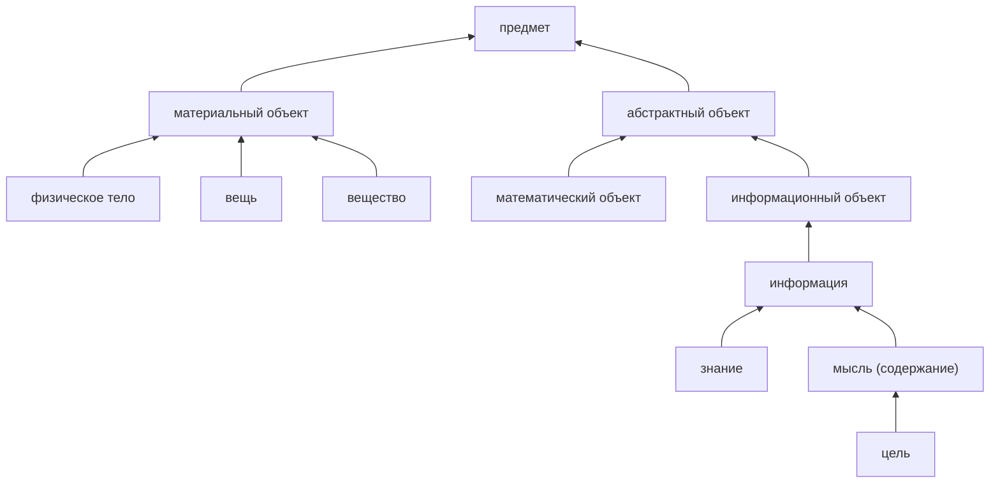

# Ревизия Q5 — верхние части графа

Последующий разбор смешанной ветви и свойств организмов: [Q6](2026-10-08-q6.md).
Ниже сохранено состояние и выводы на момент Q5.

Верхние ветви содержали смысловые ошибки, хотя проверка сигнатур уже
проходила: информационное содержание наследовало физические свойства,
знание было ментальным процессом, род и вид считались соподчинёнными,
а связи частей тела были направлены обратно. Исправлен согласованный
пакет из 77 прежних связей; добавлены 50 связей и пять понятий, объединены
три изолированных дубля, уточнены шесть канонических имён.

Охват аудита — 329 исходных узлов: корень «сущее», 20 непосредственных
видов, 298 узлов на втором шаге по кратчайшему родовому пути и десять
дополнительных опорных понятий. Рассмотрены их роды, состав дочерних
ветвей, собственные факты и наследование. Все родовые пути учитывались
как DAG, включая классификации разных универсумов. Это не полная
смысловая ревизия всех 12 тысяч понятий.

Точные ID, исходные значения, причины и проверки записаны в
[пакете Q5](../../tools/quality_20261008_q5.json).

## Подтверждённые ошибки и исправления

| Было | Исправлено |
|---|---|
| Любой предмет имеет форму и протяжённость; информационный объект — вещь | Выделены материальный и абстрактный объекты. Масса и протяжённость отнесены к материальному объекту; информационное содержание и математические объекты — к абстрактному |
| Информация — знание; знание и мысль — ментальные процессы | Знание и мысль как содержание — информация. Познание порождает знание; мышление порождает мысль |
| Цель, идея, догадка, мнение и предубеждение — виды знания | Цель, идея, догадка и мнение отнесены к мысли как содержанию; предубеждение — к мнению |
| Слово имеет знак как часть и одновременно соподчинено знаку | Слово — вид знака; значение связано с ним как содержание |
| Наука — непосредственный вид сущего | Наука отнесена к социальным явлениям; дисциплины и исследовательские процессы, разделённые в Q3, сохранены |
| Цветовые и другие качества одновременно были видами свойства и явления | Отклонены 24 ошибочных дополнительных рода; сохранены соответствующие шкалы свойств |
| Вес и температура пропускали ближайший род | Оба отнесены к физической величине, которая уточняет физическое свойство |
| Пространственная близость — явление; смысл и назначение — ментальные процессы | Близость — пространственное отношение; лишние процессуальные роды сняты со смысла и назначения |
| Корень «сущее» соподчинён своему потомку «небытие»; часть соподчинена элементу | Обе связи соподчинения отклонены; родовые связи сохранены |
| Зависимость/независимость и равенство/неравенство — противоположные понятия (63) | Для этих пар A / не-A выбран код противоречия (64) |
| Организм — непосредственная вещь и соподчинён природному объекту | Организм — природный объект; соподчинение роду снято |
| Физическое тело содержит человека и животное; кожа, шея и голова содержат тело | Направление обращено к части. Выделено тело человека: человеческая анатомия больше не приписывается любому физическому телу |
| Система имела только род и соподчинённое понятие | Добавлены структурированность и элемент системы; элемент системы связан с общим понятием элемента |

Также сняты необоснованные связи «любое явление имеет изменение (50%)»
и «информация порождает знание (95%)»: проценты не подтверждали эти
утверждения. Новым фактам произвольные степени не присваивались.
«Реальность» объединена с действительностью, «зависеть» — с зависимостью,
«принадлежать» — с принадлежностью. Полные исходные строки дублей
сохранены в манифесте. Исправлены ошибочные термины «состояяние»,
«значиение», «назначиение», «жаркее» и кириллические записи с тегом `en`.
«Мыслить» перенесено к мышлению, чтобы поиск не смешивал процесс
с его содержанием.

Часть уточнённой иерархии; стрелка направлена от вида к роду:

Это выбранное различение содержания и носителя в данной модели.
Деление на материальное и абстрактное не объявлено исчерпывающим для
всех сущностей. У абстрактной ветви 974 узла; пересечения с материальной
ветвью по родовым путям нет. Это структурная проверка, а не подтверждение
правильности каждого её потомка.

## Недостаточность и оставшиеся ошибки

1. **Смешанные верхние ветви требуют разбора дочерних понятий.**
   У «абстрактного понятия» (5766) под «явлением» — 36 разнородных детей:
   временное, бесчисленное, целебное, канцелярское, целлофановое и другие.
   Перенос всей ветви под абстрактный объект закрепил бы эти ошибки.
   У «природного объекта» (34) среди детей есть цветное, рыболовное,
   травматическое; у «физического свойства» (42) — слабовольное и
   слабонервное. Это следы классификации по фрагментам слов, а не по смыслу.
   У информационного объекта (265) также остаётся большой разнородный
   набор IT-терминов; новое положение его рода не исправляет всех детей.
2. **Свойства слишком общих родов создают ложное наследование.**
   У организма (25) остаются «кровь 95%» (ребро 573), «сон 90%» (305)
   и «кожа 50%» (7528). Эти утверждения попадают также в ветви растений
   и грибов. Нужен отдельный разбор подходящих носителей и самих
   процентов. Q5 исправляет род организма и направление связей тела,
   но не завершает ревизию биологических свойств.
3. **Поведение смешано со свойством, а модель объекта исследования
   ограничена.** «Поведение» (5909) имеет род «свойство». Простое
   переподчинение процессам ломает связь психологического исследования
   с объектом изучения (30828): код 27 допускает предмет, свойство и
   правовое явление, но не общую ветвь явлений. Нужна согласованная
   ревизия смысла поведения и отношения исследования; сигнатура в Q5
   не расширялась ради прохождения проверки.
4. **Остаются дубли с зависимыми связями.** Причинное отношение (74) и
   причинная связь (2545) пересекаются по терминам и смыслу; у второго
   узла есть связи с причиной и следствием. Аналогично требуют проверки
   математические операции 918 и 926 с собственными детьми. Для них
   недостаточно объединения изолированных листьев: необходимо проверить
   перенос фактов, контекст универсума и отличие операции от её выполнения.
5. **Не хватает содержательного описания общих категорий.** Новый аудит
   отметил 76 узлов с несколькими потомками, но без собственных фактов,
   кроме соподчинения и противопоставления. До изменений их было 72.
   Это очередь проверки, а не число доказанных пробелов: свойства могут
   наследоваться, а определение рода не обязано содержать искусственные
   факты. Для системы добавлены состав и структурированность; правила
   связей между элементами ещё не раскрыты. Время (1675) смешивает
   интервалы, возраст, частоту и прилагательные — нужна проверка значений.

Следующий проход стоит начинать с этих ветвей и наследуемых общих
свойств. Массовое добавление терминов не устранит ошибки их положения.
По всей базе остаётся 7 341 понятие без любого термина `en` с латиницей;
эта эвристика также не измеряет качество имеющихся переводов.

## Основания смысловых решений

- Слово рассматривается как языковой знак, у которого различаются
  содержательная сторона и выражение. [БРЭ: «Знак языковой»](https://old.bigenc.ru/linguistics/text/1994436).
- Система предполагает элементы, связи и организацию целого. Это
  основание для добавления состава и структурированности.
  [Новая философская энциклопедия: «Система»](https://gufo.me/dict/philosophy_encyclopedia/%D0%A1%D0%98%D0%A1%D0%A2%D0%95%D0%9C%D0%90).
- Процесс приобретения знания отличается от полученного содержания.
  [Словарная статья «Познание» на Грамоте](https://gramota.ru/meta/poznanie).
- Величина — количественно выражаемое свойство явления, тела или вещества.
  [Международный словарь по метрологии, VIM 1.1](https://jcgm.bipm.org/vim/en/1.1.html).
- Математические объекты — стандартный пример абстрактных объектов,
  но общая граница абстрактного и конкретного остаётся предметом
  философского обсуждения. Иерархия Q5 — решение для данного графа.
  [Stanford Encyclopedia of Philosophy: Abstract Objects](https://plato.stanford.edu/entries/abstract-objects/).

## Измерения и проверки

| Показатель | До Q5 | После Q5 |
|---|---:|---:|
| Понятия | 12 472 | 12 474 |
| Принятые связи | 15 701 | 15 670 |
| Все связи, включая отклонённые | 16 353 | 16 399 |
| Пути рода | 54 623 | 57 294 |
| Термины | 34 855 | 34 869 |
| Нарушения сигнатур, циклы, самопетли, отсутствующие концы | 0 | 0 |
| Понятия с кириллицей без латиницы в записи `en` | 7 482 | 7 477 |
| Понятия без любого термина `en` с латинской буквой | 7 342 | 7 341 |

77 ошибочных рёбер сохранены со статусом `rejected` и объяснениями.
У трёх объединённых дублей архивированы и удалены четыре родовые
связи и восемь терминных записей; ещё 14 неверных записей терминов
удалены у сохраняемых узлов. Число принятых связей уменьшилось за счёт
удаления ошибок и избыточности, а пути удлинились из-за уточнения родов.
Ни один из этих счётчиков сам по себе не оценивает качество.

| Проверяемый признак в верхней области | До | После |
|---|---:|---:|
| Соподчинение предка и потомка | 2 | 0 |
| Пропуск промежуточного рода при уже имеющемся пути | 1 | 0 |
| Одновременное наследование свойства и явления | 24 | 0 |
| Физические свойства на проверяемых абстрактных ветвях | 2 | 0 |

После переподчинения исходные узлы остаются в области сравнения, даже
если стали глубже второго уровня. Итоговая область содержит 330 узлов,
включая новые верхние понятия и исключая объединённые дубли. Число
узлов на первых двух шагах уменьшилось с 319 до 226; исчезновение из
видимого верхнего яруса не использовалось как доказательство исправления.

Пробный прогон завершился откатом. После него сопоставлены все исходные
строки: 12 472 понятия, 16 353 связи и 34 855 терминов. Сохранение
выполнено одной транзакцией после полного SQL-бэкапа. Пути и определения
пересобраны движком из канонических имён; текст определений вручную
не редактировался.

Пройдены 302 условия Q5 и три проверки объединения, 1 174 прежних условия
Q1–Q4 и 63 прежние проверки объединения. Проверены десять поисковых
запросов через `ask.py`. Все 23 явных отрицания сохранены; таблица
грамматики не менялась. 19 модульных тестов проверяют защиту объединений,
обход DAG, сохранение области сравнения и учёт более близких отрицаний.
Повторное применение пакета не меняет наполнение.

Отчёты: [исходный аудит](2026-10-08-q5-before.json),
[верхние узлы до изменений](2026-10-08-q5-upper-before.json),
[пробный прогон](2026-10-08-q5-preview.json),
[сравнение после отката](2026-10-08-q5-rollback.json),
[применение](2026-10-08-q5-applied.json),
[итоговый аудит](2026-10-08-q5-after.json),
[верхние узлы после изменений](2026-10-08-q5-upper-after.json),
[проверки, определения и поисковые примеры](2026-10-08-q5-verification.json),
[повторный прогон](2026-10-08-q5-idempotence.json),
[экспорт](2026-10-08-q5-export.json).

Резервная копия до изменений:
`G:\Projects\conceptuum-backups\20261008-160403-before-quality.sql`.
Итоговый снимок:
`G:\Projects\conceptuum-backups\20261008-160708-after-quality-q5.sql`.
Прежние рабочие SQL и gzip сохранены рядом с префиксом
`20261008-160708-before-q5-export-`. Обновлённый `jnana3_dump.sql` содержит
шесть таблиц, 5 195 879 байт; gzip — 786 135 байт. Распаковка совпадает
с SQL побайтно. SHA-256 SQL:
`2f11f509fc6431745d1471ae9be79aa7581c0b6d9adb21e90958d5559d644378`.
