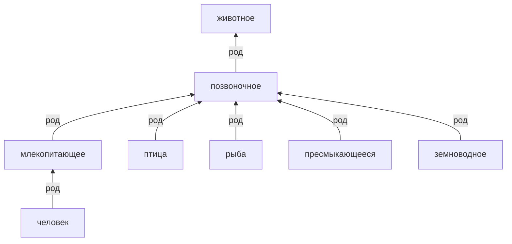

# Ревизия Q6 — смешанная ветвь и свойства организмов

Продолжение [Q5](2026-10-08-q5.md). Разобраны все 36 прежних детей
«абстрактного понятия»: восемь изолированных дублей объединены,
остальные получили род по выбранному значению. Само абстрактное понятие
отнесено к понятию. Исправлены также наследование биологических свойств,
смешение кожи-органа с кожей-материалом и несколько направлений частей тела.

Отклонены 48 прежних связей, включая 35 родовых; добавлены 48 связей,
два понятия, уточнено 21 каноническое имя. Все решения, выбранные значения,
источники, исходные строки дублей и проверяемые условия — в
[пакете Q6](../../tools/quality_20261008_q6.json).

## Разбор «абстрактного понятия»

Название логического вида не делает его родом всех вещей, свойств и
отношений, о которых можно образовать понятие. Узел 5766 теперь имеет
род «понятие» (2423), а прежних ошибочных дочерних связей у него нет.
После объединений исходные 36 записей разрешаются в 30 сохраняемых
понятий: 28 прежних узлов и два уже существовавших за пределами ветви.

| Группа | Результат |
|---|---|
| Многочисленное, малочисленное, немногочисленное | Многочисленность и малочисленность отнесены к новой шкале «численность» (24475); немногочисленное объединено с малочисленностью |
| Бесчисленное, неисчислимое | Объединены в бытовом значении очень большого количества; отнесены к многочисленности. Математическая бесконечность не приписывается |
| Временное, кратковременное | Временность отнесена к длительности; кратковременное объединено с существующей краткостью в значении длительности |
| Преждевременное, безвременное, своевременное, заблаговременное | Различены отношение к нужному времени и совершение заранее. Безвременный сохранён как словарный термин преждевременности |
| Единовременное | Уточнена однократность; не смешивается с одновременностью нескольких событий |
| Участливое, безучастное, причастное, непричастное, участковое | Разделены нравственное качество, равнодушие, отношение причастности и признак через участок |
| Целомудренное, целеустремлённое | Целомудрие отнесено к нравственным качествам, целеустремлённость — к ментальным свойствам |
| Целебное, целительное | Объединены в целебность как полезное свойство; не отнесены к лечению как действию |
| Несчастливое, несчастненькое, разнесчастное | Объединены в несчастливое состояние; несчастье как событие осталось отдельным понятием |
| Бесцельное, нецелесообразное, несовременное | Отнесены к оценочным свойствам с различением отсутствия цели, несоответствия цели и несоответствия своему времени |
| Судьба | Выбран и обозначен смысл хода событий; род — процесс, без утверждения сверхъестественной причинности |
| Порядковое | Уточнено порядковое положение; род — порядок |
| Участковое, вышеперечисленное, прицельное, канцелярское, целевое, вычислительное, целлофановое | Отнесены к относительному свойству (24474), определяемому через другой объект, действие или контекст |

Последняя группа объединена по смыслу признака, а не по части речи.
Например, вычислительный признак не является видом вычисления, а
признак материала изготовления — видом логического понятия. Установленные
прилагательные сохранены; искусственные существительные из них не образованы.
Конкретные носители этих свойств и их связи с материалом, целью или текстовым
контекстом требуют дальнейшего наполнения.

Добавлены противоположность многочисленности и малочисленности,
противоположность участливости и безучастности, противоречие причастности
и непричастности. Безучастность не объединялась с непричастностью:
человек может участвовать в событии и оставаться равнодушным к нему.

## Биологические свойства и анатомия

Кровь и анатомическая кожа сняты с общего организма и закреплены
у позвоночных. Млекопитающие, птицы, рыбы, пресмыкающиеся и земноводные
получили существующий ближайший род «позвоночное»; человек —
«млекопитающее». Это бытовая классификация существующих групп,
а не новая полная филогенетическая система.

Способность ко сну снята с общего организма и положительно указана
у млекопитающих и птиц. Это не утверждение, что другие группы животных
не спят. Новых отрицаний или произвольных процентов не добавлялось.
Для 121 понятия в ветви растений и 15 понятий в ветви грибов, включая
корни ветвей, проверено отсутствие наследования крови, анатомической
кожи и способности ко сну.

Кожа как материал (241) переименована в «кожа (материал)» и получила
английское `leather`; ошибочное `skin` удалено. Анатомический `skin`
остаётся у кожи тела (2083). Общая русская форма «кожа» позволяет искать
оба значения. Снята неверная связь всего животного царства с кожей-материалом.

Обращены связи «скелет содержит животное», «мышца содержит животное»
и «волосы содержат человека». Положительные анатомические связи заданы
у позвоночных и тела человека. Обратные связи клюва и пера с птицей
сняты; уже существовавшие правильные направления сохранены. Спальня
получила назначение «сон» вместо способности спать. Убраны
необоснованные общие утверждения о мясе, хвосте и лапах у всех животных;
существовавшие явные отрицания у человека и отдельных видов сохранены.

## Проверка слов и источников

- **Безвременный** в выбранном значении относится к чрезмерно раннему
  наступлению; он не заменён на вневременный.
  [Активный словарь русского языка, ИРЯ РАН](https://sensefreq.ruslang.ru/w/RNC%20%28adjectives%29/%D0%B1%D0%B5%D0%B7%D0%B2%D1%80%D0%B5%D0%BC%D0%B5%D0%BD%D0%BD%D1%8B%D0%B9).
- **Целебный / целительный** проверены вместе с существительным
  «целебность». [Грамота](https://gramota.ru/meta/tselebnyy).
- **Несчастненький** подтверждён как уменьшительная форма, а
  **разнесчастный** — как усилительная. Удалена ошибочная запись
  «несчастненькее», правильные формы сохранены.
  [Большой универсальный словарь на Грамоте](https://gramota.ru/poisk?dicts%5B0%5D=48&mode=slovari&query=%D0%BD%D0%B5%D1%81%D1%87%D0%B0%D1%81%D1%82%D0%BD%D1%8B%D0%B9&simple=0),
  [толковая статья «Разнесчастный»](https://slovar.cc/rus/tolk/97897.html).
- Выбранное значение **судьбы** основано на словарном описании хода событий.
  [Грамота](https://gramota.ru/meta/sudba).
- Различение непосредственного признака и признака через отсылку
  подкреплено языковой справкой. Род «относительное свойство» и его
  конкретное наполнение — решение этой модели.
  [Справка Грамоты](https://gramota.ru/poisk?mode=spravka&page=213&query=%D0%9A%D0%BB%D0%B8%D1%82%D0%B8%D0%BD).
- Положительное утверждение о крови у позвоночных и уточнение их групп
  проверены по учебнику биологии.
  [OpenStax: кровообращение](https://openstax.org/books/biology-2e/pages/40-1-overview-of-the-circulatory-system),
  [OpenStax: хордовые и позвоночные](https://openstax.org/books/biology-2e/pages/29-1-chordates).
- Сон млекопитающих и птиц подтверждается исследованием сна птиц;
  количественные оценки из исследования в граф не переносились.
  [Canavan, Margoliash, 2020](https://pmc.ncbi.nlm.nih.gov/articles/PMC7707536/).

Дополнительные словарные источники для неисчислимого, единовременного,
причастного и участкового сохранены непосредственно в манифесте.

## Результаты и сохранность

| Показатель | До Q6 | После Q6 |
|---|---:|---:|
| Понятия | 12 474 | 12 468 |
| Принятые связи | 15 670 | 15 662 |
| Все связи, включая отклонённые | 16 399 | 16 439 |
| Пути рода | 57 294 | 57 948 |
| Термины | 34 869 | 34 934 |
| Понятия с кириллицей без латиницы в записи `en` | 7 477 | 7 439 |
| Понятия без любого термина `en` с латинской буквой | 7 341 | 7 306 |
| Нарушения сигнатур, циклы, самопетли, отсутствующие концы | 0 | 0 |

У восьми дублей архивированы и удалены восемь родовых связей и 17
терминных записей. Ещё 35 неверных записей удалены у сохраняемых узлов.
Все 30 понятий, в которые разрешаются прежние дети абстрактного понятия,
имеют английские термины без кириллических записей `en`.
Снижение общих языковых флагов включает удалённые дубли и не равно
числу вновь переведённых понятий.

Пробный прогон проверен полным сравнением исходных строк после отката:
12 474 понятия, 16 399 связей, 34 869 терминов. Финальный пакет применён
одной транзакцией после SQL-бэкапа; пути и определения пересобраны движком.
Первый пробный прогон выявил совпадение вариантов с «е/ё» по индексу
MariaDB; список терминов скорректирован и проверен повторно до сохранения.

Пройдены 384 условия Q6 и восемь проверок объединения, 1 476 условий
Q1–Q5 и 66 прежних проверок объединения. Дополнительно проверены
наследование в растениях и грибах, положительные анатомические свойства
шести групп и 15 поисковых запросов на русском и английском.
Все 23 явных отрицания и хэш грамматики сохранены. Повторный прогон
не меняет наполнение.

Верхний аудит сохраняет исходные узлы при переподчинении глубже видимого
уровня. Четыре ранее исправленных класса структурных конфликтов остаются
нулевыми. Отсутствие собственных фактов у верхнего узла по-прежнему
считается поводом для проверки, а не доказательством неполноты.

Отчёты: [исходный аудит](2026-10-08-q6-before.json),
[верхняя область до изменений](2026-10-08-q6-upper-before.json),
[пробный прогон](2026-10-08-q6-preview.json),
[проверка отката](2026-10-08-q6-rollback.json),
[применение](2026-10-08-q6-applied.json),
[итоговый аудит](2026-10-08-q6-after.json),
[верхняя область после изменений](2026-10-08-q6-upper-after.json),
[проверки и примеры](2026-10-08-q6-verification.json),
[повторный прогон](2026-10-08-q6-idempotence.json),
[экспорт](2026-10-08-q6-export.json).

Бэкап до изменений:
`G:\Projects\conceptuum-backups\20261008-163836-before-quality.sql`.
Снимок после изменений:
`G:\Projects\conceptuum-backups\20261008-164343-after-quality-q6.sql`.
Прежние рабочие дампы сохранены с префиксом
`20261008-164343-before-q6-export-`. Текущий SQL содержит шесть таблиц,
5 228 610 байт; gzip — 793 270 байт. Распаковка побайтно совпадает с SQL.
SHA-256 SQL: `8fe09de310415425f6779476abb9c3cd6b09955c3aa0ac6b67491abaa05b2be6`.

## Следующий проход

- Разобрать ошибочных детей природного объекта (34), физических (42)
  и ментальных (47) свойств, а также времени (1675).
- Проверить роли в процессах: у сна остаётся связь с организмом как
  объектом процесса (7768), хотя общая способность организма спать уже
  снята. «Поведение» (5909) и объект психологического исследования (30828)
  также требуют согласованного смыслового решения.
- Объединить дубли причинности (74/2545) и математических операций
  (918/926) после проверки и переноса зависимых фактов.
- Продолжить биологическую классификацию: простейшие и отдельные группы
  животных всё ещё имеют грубые роды; другие старые проценты не проверены.
- Дополнить относительные свойства связями с конкретными носителями и
  контекстами; наличие рода и перевода ещё не даёт полного определения.
