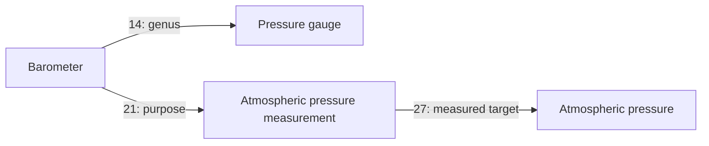

# Q11 — dictionary-guided measurement concepts

> Included in the Q39 repository and site publication on 2026-10-09.
> Local-only statements below record the original review session.

Applied locally on 2026-10-09 following the request to compare a large English
dictionary and add missing concepts. **59 concepts and 85 relations were
added; 14 existing meanings were reused and two genera refined.** The local
database, SQL snapshot, version metadata, and documentation are updated.
No commit, push, or deployment was made; Q9 remains the published reference.

The [reviewed manifest](../../tools/quality_20261009_q11.json) records selected
meanings, dictionary sense IDs, existing-term collisions, exact repaired rows,
source attribution, and 366 required or forbidden outcomes.

## Dictionary and comparison

Source: [Open English WordNet 2025, base edition](https://en-word.net/downloads),
released 2025-12-31. This edition excludes the separate Namenet supplement.
Counts below were computed from the downloaded XML, not estimated from the
dictionary website.

| Measure | Count |
|---|---:|
| Lexical entries | 135,969 |
| Distinct normalized lemma strings | 127,311 |
| Lexical senses | 185,129 |
| Synsets (groups of synonymous senses) | 107,519 |
| Normalized lemmas with an exact existing EN candidate | 3,822 |
| Synsets with at least one exact EN candidate | 15,298 |
| Synsets with no exact EN candidate | 92,221 |
| Existing concepts reached by these candidate matches | 3,923 |

The comparison used the **pre-Q11/Q10 database**, all English-tagged terms
containing Latin letters, Unicode NFKC normalization, case folding, underscore
replacement, and whitespace normalization. It compared every dictionary entry.
Case folding intentionally produces possible homonyms such as Newton/newton;
it does not establish sense identity or preserve case-sensitive unit symbols.

**These are lexical candidates, not semantic coverage scores.** The 92,221
unmatched synsets are not 92,221 missing concepts. Before this batch, 7,302
concepts lacked any English-tagged term containing Latin letters. Selected
candidates were therefore checked against every existing canonical name and
RU/EN alias, their parents, and the dictionary's separate definitions. The
59 additions are a reviewed first cohort, not a bulk dictionary import.

The pinned XML archive is 11,363,503 bytes. SHA-256:

`9ca6d1dcb75f822fdd66617f7d9da48142ace38dd544d6ad5e2feca1674ad3fe`

[Download the same edition](https://en-word.net/static/english-wordnet-2025.xml.gz). Raw XML, the parsed dictionary,
the complete candidate inventory, and temporary review scripts are kept in
`G:\Projects\conceptuum-backups\dictionary-oewn-2025-20261009`, outside the
repository. The manifest preserves enough provenance to retrieve the selected
synsets without those temporary files.

## Reviewed changes

- **13 unit families and 24 units:** mass, area, volume, force, pressure,
  energy, power, current, voltage, resistance, frequency, amount of substance,
  and luminous intensity. Together with existing metre and second, the
  database now contains the names of all seven SI base units. Existing tonne
  and degree Celsius were reused. SI base-unit status is review metadata;
  this batch does not add a separate SI-base-unit class.
- **Four quantity targets:** electric current strength, voltage, electrical
  resistance, and atmospheric pressure. Existing temperature, length,
  distance, duration, mass, and pressure are reused.
- **Nine measurement actions:** temperature, length, distance, duration,
  pressure, atmospheric pressure, current, voltage, and resistance measurement.
  Existing weighing is reused for mass measurement. Eight action labels are
  composed meanings grounded in instrument definitions; they are not claimed
  to be standalone OEWN synsets.
- **Nine instrument concepts:** the common measuring-instrument genus plus
  pressure gauge, barometer, ammeter, voltmeter, ohmmeter, stopwatch, odometer,
  and micrometer instrument. Existing thermometer moves under the new genus.
  Ruler, tape measure, and scales gain that classification while keeping their
  tool classification. Purpose and patient links account for 21 new relations.

The two withdrawn genus assertions remain as rejected historical rows:
thermometer 3555 → device 3352 (edge 5825), and tonne 3563 → measure 2650
(edge 5833). Their more specific replacement parents are measuring instrument
24564 and mass unit 24514.



No instrument is asserted to possess the measured property as its own
attribute. Every new assertion uses U1 and unspecified strength. Definitions
are regenerated from the graph; no cached definition is manually overwritten.

## Sense distinctions and source corrections

| Candidate | Reviewed decision |
|---|---|
| Newton / newton | Existing 3167 is a person. New 24546 is a qualified force-unit concept. The person record is unchanged. |
| Pascal / pascal | Existing 379 is the programming language in U3. New 24547 is a pressure unit in U1. |
| mole / Russian mole homonym | Existing 1322 is the English mammal sense; 1377 is the Russian insect sense. New 24549 is the amount-of-substance unit. |
| micrometer | Unit 24533 and instrument 24572 have separate qualified labels and dictionary sense IDs. Both retain the ambiguous spelling for lookup. |
| tonne / ton | Existing tonne 3563 is reused. The unqualified English `ton` is omitted because short and long tons differ from the metric tonne. |
| litre and cubic decimetre | One unit, two labels. Likewise millilitre/cubic centimetre and cubic metre/kilolitre are single concepts with aliases. |
| gram and kilogram | Both are mass units. Neither is a kind of the other; the scale factor is not a genus edge. |
| mole in OEWN | OEWN places the unit under a mass-unit family and describes gram molecular weight. BIPM classifies it as amount of substance; that distinction controls the graph. |
| candela in OEWN | The unit name is retained; the historical black-body formulation and casual `candle` synonym are omitted. |
| resistance in OEWN | Resistivity, impedance, and the resistor device are excluded from the resistance term list. They need separate meanings. |
| voltage in OEWN | The potential-difference sense is used. The erroneous charge-difference gloss and absolute-potential synonym are not imported. |
| electric current | The measured quantity is distinguished from the dictionary flow-phenomenon sense. This is an explicit related-sense mapping. |
| measuring instrument/system | A device is represented here. The broader `measuring system` synonym is omitted. |

Unit meanings and classifications were checked against the
[BIPM SI Brochure, ninth edition, version 4.01 (June 2026)](https://www.bipm.org/documents/20126/41483022/SI-Brochure-9-EN.pdf),
especially tables 2, 4, 7 and 8, and the VIM entries for
[measurement unit](https://jcgm.bipm.org/vim/en/1.9.html) and
[measuring instrument](https://jcgm.bipm.org/vim/en/3.1.html).
Dictionary hierarchies, antonyms and synonyms were not copied automatically.

## New concept inventory

English labels are shown here; every new record also has a Russian label.
The manifest includes all aliases and source decisions.

| Concept ID | Selected English meaning | Direct genus ID |
|---|---|---|
| 24514 | mass unit | 2651 |
| 24515 | area unit | 2651 |
| 24516 | volume unit | 2651 |
| 24517 | force unit | 2651 |
| 24518 | pressure unit | 2651 |
| 24519 | energy unit | 2651 |
| 24520 | power unit | 2651 |
| 24521 | electric current unit | 2651 |
| 24522 | voltage unit | 2651 |
| 24523 | electrical resistance unit | 2651 |
| 24524 | frequency unit | 2651 |
| 24525 | unit of amount of substance | 2651 |
| 24526 | luminous intensity unit | 2651 |
| 24527 | kilogram | 24514 |
| 24528 | gram | 24514 |
| 24529 | milligram | 24514 |
| 24530 | millimetre | 24457 |
| 24531 | centimetre | 24457 |
| 24532 | kilometre | 24457 |
| 24533 | micrometre | 24457 |
| 24534 | litre | 24516 |
| 24535 | millilitre | 24516 |
| 24536 | cubic metre | 24516 |
| 24537 | square metre | 24515 |
| 24538 | hectare | 24515 |
| 24539 | kelvin | 24459 |
| 24540 | ampere | 24521 |
| 24541 | volt | 24522 |
| 24542 | ohm | 24523 |
| 24543 | watt | 24520 |
| 24544 | kilowatt | 24520 |
| 24545 | joule | 24519 |
| 24546 | newton | 24517 |
| 24547 | pascal | 24518 |
| 24548 | hertz | 24524 |
| 24549 | mole | 24525 |
| 24550 | candela | 24526 |
| 24551 | electric current (quantity) | 2709 |
| 24552 | voltage | 2709 |
| 24553 | electrical resistance | 2709 |
| 24554 | atmospheric pressure | 5196 |
| 24555 | temperature measurement | 3867 |
| 24556 | length measurement | 3867 |
| 24557 | distance measurement | 3867 |
| 24558 | duration measurement | 3867 |
| 24559 | pressure measurement | 3867 |
| 24560 | atmospheric pressure measurement | 24559 |
| 24561 | electric current measurement | 3867 |
| 24562 | voltage measurement | 3867 |
| 24563 | electrical resistance measurement | 3867 |
| 24564 | measuring instrument | 3352 |
| 24565 | pressure gauge | 24564 |
| 24566 | barometer | 24565 |
| 24567 | ammeter | 24564 |
| 24568 | voltmeter | 24564 |
| 24569 | ohmmeter | 24564 |
| 24570 | stopwatch | 24564 |
| 24571 | odometer | 24564 |
| 24572 | micrometer (instrument) | 24564 |

## Coverage and remaining work

The fixed 14-record existing cohort has direct non-taxonomic relations on
9 records before and 10 afterward. Among the 59 additions,
22 have direct purpose or patient relations. All new records have RU and
Latin-script EN terms. Unit families and units mainly expand classification;
these counts do not establish complete definitions.

Numerical scale factors and the distinction between Celsius values and kelvin
values are documented in review reasons, not executable conversion relations.
The graph still needs a suitable representation for quantity values, unit
conversion, and affine temperature conversions. No generic attribute relation
has been repurposed for that task.

Continue with humidity/wind/rotation instruments, the caliper family, and
mathematical ratio/percentage vocabulary. Existing humidity 5914, frequency
5026, clock 1581, level 2339, and acceleration 10646 need sense review first.
Physical power, area, volume, and density also need a selected quantity meaning.
The Newton person name, broad duration/frequency children, and inherited
assertions on the general device branch are outside this batch's repairs.
See the active [filling queue](../../PLAN.md).

## Local verification

| Measure | Local Q10 | Local Q11 |
|---|---:|---:|
| Concepts | 12,499 | 12,558 |
| All edges | 16,560 | 16,645 |
| Accepted edges | 15,734 | 15,817 |
| Rejected edges | 826 | 828 |
| Genus paths | 58,142 | 58,486 |
| Terms | 35,112 | 35,290 |
| Concepts without Latin-script English terms | 7,302 | 7,302 |

The rollback preview passed 366 semantic conditions. A fresh read confirmed
that all original concept, term, edge, and grammar rows survived that rollback.
The local apply then passed the same conditions. Fresh post-apply reads checked
the exact U1 assertions, identities, preserved home contexts, all 16,558
unmodified existing edges, every old term, all 23 explicit negations, all 29
grammar rows, and all five universe rows. 178 term rows were added; none were removed.

No signature violations, taxonomy cycles, self-loops, dangling endpoints,
invalid strengths, or deprecated relation codes were detected. Application
test suites were not run. The SQL export and existing compressed copy decode
to identical bytes. The code and interface versions are unchanged.

SQL SHA-256: `b4995c8bbdfe2cb83a34441dadd0f08c2d3331f40353ba90eddd4e16bc0ba7d8`.

Pre-change backup: `G:\Projects\conceptuum-backups\20261009-083157-before-quality.sql`.

Git HEAD remains `a4b334b402e1863c30a03e4b0759cb783d153a65` and the index remains empty.
The three pre-existing modified QA files are unchanged. All work is local.

## Sources and reuse

The reviewed lexical selection and mappings adapt **Open English WordNet 2025**
by the Open English WordNet Team, derived from **Princeton University WordNet**.
OEWN's additions are available under
[Creative Commons Attribution 4.0](https://creativecommons.org/licenses/by/4.0/).
See its [source license](https://github.com/globalwordnet/english-wordnet/blob/2025-edition/LICENSE.md)
and [underlying WordNet notice](https://github.com/globalwordnet/english-wordnet/blob/2025-edition/WNDB_License.txt).
Changes include Russian labels, selected synonyms, restricted senses, corrected
unit classifications, and conceptuum-specific graph relations. These adaptations
do not imply endorsement by the source authors.

The **BIPM SI Brochure**, ninth edition, version 4.01, June 2026, is also
distributed under CC BY 4.0. It supports the reviewed unit names, quantities,
and classifications; this graph is an adaptation, not the SI specification.
Project code remains under the repository's [MIT license](../../LICENSE).

The following notice is reproduced from the pinned edition's
`WNDB_License.txt`, with its line-number prefixes removed. Its historical
2023 date is retained as supplied by the 2025 distribution:

```text
This software and database is being provided to you, the LICENSEE, by
the Open English Wordnet team under the Creative Commons Attribution 4.0
International License (CC-BY 4.0).

Open English Wordnet 2023 Copyright 2023 by the Open English Wordnet team.

Permission to use, copy, modify and distribute this software and
database and its documentation for any purpose and without fee or
royalty is hereby granted, provided that you agree to comply with
the following copyright notice and statements, including the disclaimer,
and that the same appear on ALL copies of the software, database and
documentation, including modifications that you make for internal
use or for distribution.

WordNet 3.1 Copyright 2011 by Princeton University.  All rights reserved.

THIS SOFTWARE AND DATABASE IS PROVIDED "AS IS" AND PRINCETON
UNIVERSITY MAKES NO REPRESENTATIONS OR WARRANTIES, EXPRESS OR
IMPLIED.  BY WAY OF EXAMPLE, BUT NOT LIMITATION, PRINCETON
UNIVERSITY MAKES NO REPRESENTATIONS OR WARRANTIES OF MERCHANT-
ABILITY OR FITNESS FOR ANY PARTICULAR PURPOSE OR THAT THE USE
OF THE LICENSED SOFTWARE, DATABASE OR DOCUMENTATION WILL NOT
INFRINGE ANY THIRD PARTY PATENTS, COPYRIGHTS, TRADEMARKS OR
OTHER RIGHTS.

The name of Princeton University or Princeton may not be used in
advertising or publicity pertaining to distribution of the software
and/or database.  Title to copyright in this software, database and
any associated documentation shall at all times remain with
Princeton University and LICENSEE agrees to preserve same.
```
