# Q12 — humidity, motion measurement, and instrument families

> Included in the Q39 repository and site publication on 2026-10-09.
> Local-only statements below record the original review session.

Applied locally on 2026-10-09, continuing the dictionary-guided filling request.
**37 concepts and 74 relations were added.** The review covers a fixed
22-record existing cohort, qualifies three canonical labels, withdraws eight
relations, and removes four malformed or mistagged terms. No concepts were merged.
The local database, SQL snapshot, version metadata, and documentation are updated.
No commit, push, or deployment was made; Q9 remains the published reference.

The [reviewed manifest](../../tools/quality_20261009_q12.json) records source
sense IDs, mapping restrictions, existing-term collisions, exact withdrawn rows,
and 275 required or forbidden outcomes. This is a selected cohort, not a
bulk synonym or hypernym import.

## Dictionary comparison and source policy

Q12 reuses the pinned **Open English WordNet 2025 base edition** from
[Q11](2026-10-09-q11.md): 135,969 lexical entries, 185,129 senses, and
107,519 synsets. Its archive SHA-256 remains
`9ca6d1dcb75f822fdd66617f7d9da48142ace38dd544d6ad5e2feca1674ad3fe`.
The [official downloads](https://en-word.net/downloads) and
[2025 release](https://github.com/globalwordnet/english-wordnet/releases/tag/2025-edition)
identify the source. The separate Namenet supplement is excluded.

The full normalized English comparison was refreshed against Q11 before this
batch. **15,349 synsets have at least one exact English candidate; 92,170 do
not.** Candidate matches reach 3,970 existing concepts. These are lexical
matches, not semantic coverage scores. The unmatched count does not establish
that those meanings are absent from the Russian database.

Selected meanings were checked against all existing canonical names and RU/EN
aliases, their parents, and their graph context. Matching uses Unicode NFKC,
case folding, underscore/space normalization, and Russian yo/ye normalization
for Russian probes. A spelling collision is reviewed as a possible homonym.
Productive measurement phrases and instrument families are identified as
adaptations; their related instrument synset is not claimed to define the
measurement action itself.

Raw dictionary files stay in
`G:\Projects\conceptuum-backups\dictionary-oewn-2025-20261009`.
Q12 snapshots, complete candidate matches, temporary scripts, and machine
verification receipts stay in
`G:\Projects\conceptuum-backups\quality-q12-20261009`, outside the repository.

## Reviewed changes

- **Humidity:** reuse broad wetness 5914 and the existing damp/wet meanings.
  Add air humidity, relative and absolute humidity, dew-point temperature,
  two measurement actions, hygrometer, psychrometer, and wet/dry-bulb
  thermometers. Purpose and target links connect the instruments to the
  selected quantities. The psychrometer has both thermometer components.
- **Motion measurement:** add wind speed, periodic frequency, rotational
  frequency, revolutions per minute, physical acceleration, five measurement
  actions, anemometer, speedometer, tachometer, and accelerometer. Rotation
  and wind gain their corresponding rate properties.
- **Dimensional tools:** add a length-measuring instrument family, sliding
  calipers with vernier/dial/digital subtypes, diameter length, diameter/depth
  measurement, and depth gauge. Existing ruler, tape measure, and micrometer
  instrument receive the nearer family while preserving their purposes.
- **Timekeeping and levels:** add timekeeping, timepiece, interval timer, and
  spirit level. Existing clock and stopwatch move under timepiece. Qualify
  the existing measuring-level label and classify it as a measuring instrument.

The 26 new non-taxonomic relations use attributes/components (20),
purpose (21), or the target of an action (27). Every new assertion has
unspecified strength and uses U1. Existing home contexts are preserved;
change 2606 retains its U5 parent and receives the corresponding U1 genus
needed for the repaired acceleration process. U2 remains empty.

```mermaid
graph LR
  psychrometer["Psychrometer"] -->|"14: genus"| hygrometer["Hygrometer"]
  psychrometer -->|"21: purpose"| measurement["Relative humidity measurement"]
  measurement -->|"27: measured target"| humidity["Relative humidity"]
  psychrometer -->|"20: component"| dry["Dry-bulb thermometer"]
  psychrometer -->|"20: component"| wet["Wet-bulb thermometer"]
```

Definitions are regenerated from the graph. More detailed source distinctions
remain in the review metadata where suitable graph assertions are not yet
available; a name and genus alone do not encode every operating characteristic.

## Sense distinctions and source corrections

| Candidate | Reviewed decision |
|---|---|
| Wetness / humidity | Existing wetness 5914 remains broader than air humidity. Its moisture alias also has a legitimate dictionary wetness sense and is retained. |
| Relative / absolute humidity | Relative humidity concerns saturation at the same temperature; absolute humidity is water-vapour mass per air volume. They receive separate quantity records. |
| Dew point | Add it under temperature, not geometrical point or humidity percentage. |
| Anemometer | Wind speed is its selected target. OEWN's wind-direction capability is not imposed on every anemometer. |
| Frequency | Remove the generic record's time genus, retain its quantity genus, and introduce the narrower physical periodic-frequency meaning. |
| Rotational frequency | Distinguish revolutions per unit time from angular velocity. RPM is a unit, not the quantity itself. Oscillation frequency is not imported as a synonym of every periodic frequency. |
| Acceleration | Existing 10646 is the speeding-up process; new 24587 is the physical quantity. Velocity change includes direction changes and slowing down, beyond OEWN's increase-only wording. |
| Accelerometer | Retain the measuring role without limiting applications to aircraft or rockets. No universal zero-at-rest or gravity-compensation claim is added. |
| Caliper | The new sliding-caliper meaning matches the Russian instrument label. The broader English caliper umbrella is deferred; micrometers are not made sliding calipers. Bare caliper remains a lookup term for the qualified meaning. |
| Vernier caliper | Exclude the ambiguous vernier micrometer synonym. Vernier, dial, and digital displays have separate subtype records. |
| Diameter | Existing 2888 is qualified as the geometric segment; new 24602 denotes its length. Both retain bare diameter terms for lookup. |
| Timepiece / timekeeper | The instrument is distinct from a person timing an event. Generic counting-out verbs are not merged into timekeeping. |
| Timer / stopwatch | The chosen interval-timer sense includes an end signal. Stopwatches stay siblings under timepiece; no end signal is required of every stopwatch. |
| Level | Existing 2339 is the broad measuring instrument. The new spirit-level subtype is not limited to horizontal readings. |

Humidity meanings follow the [US National Weather Service humidity explanation](https://www.weather.gov/lmk/humidity).
The [NWS glossary](https://www.weather.gov/otx/Full_Weather_Glossary) supports
the selected hygrometer and anemometer functions. Motion distinctions use
[OpenStax on acceleration](https://openstax.org/books/physics/pages/3-1-acceleration),
the [Hioki tachometer manual](https://www.hioki.com/download/28346), and
[Analog Devices on accelerometers](https://www.analog.com/en/resources/glossary/accelerometer.html).

Caliper types and applications were checked against
[Mitutoyo's caliper guide](https://www.mitutoyo.com/metrology-insights/mitutoyo-calipers-digital-dial-and-vernier-calipers-precision-measurement-tools-for-manufacturing/).
The Russian sliding-caliper label was checked in
[Gramota's dictionary entry](https://gramota.ru/poisk?mode=slovari&query=%D1%88%D1%82%D0%B0%D0%BD%D0%B3%D0%B5%D0%BD%D1%86%D0%B8%D1%80%D0%BA%D1%83%D0%BB%D1%8C&simple=0).
[STABILA's spirit-level specification](https://www.stabila.com/en/products/details/type-70-spirit-level.html)
provides a counterexample to a universal horizontal-only restriction.
The [BIPM SI Brochure](https://www.bipm.org/documents/20126/41483022/SI-Brochure-9-EN.pdf)
supports separating physical quantities from their units.

## Existing rows repaired

| Edge ID | Withdrawn assertion | Result |
|---|---|---|
| 7492 | Frequency 5026 → time 1675 | Retain the existing quantity genus; review mixed descendants separately. |
| 14730 | Acceleration process 10646 → communication 64 | Replace with change 2606 in U1. The old strength=100 is preserved in the rejected row. |
| 32008 | Ruler 1501 → measuring instrument 24564 | Use the nearer length-measuring instrument 24597. |
| 32010 | Tape measure 2338 → measuring instrument 24564 | Use the nearer length-measuring instrument 24597. |
| 31986 | Micrometer instrument 24572 → measuring instrument 24564 | Use the nearer length-measuring instrument 24597. |
| 2340 | Clock 1581 → household appliance 1571 | Use timepiece 24607. |
| 31982 | Stopwatch 24570 → measuring instrument 24564 | Use timepiece 24607; preserve duration measurement as its purpose. |
| 2919 | Clock 1581 → arithmetic counting 1818 as purpose | Inherit timekeeping from the new timepiece family. |

These eight rows remain as rejected history. The other
**16,637 pre-existing edges are unchanged row for row**.
Canonical labels are qualified for acceleration 10646, diameter 2888, and
measuring level 2339; their old Russian labels remain searchable.

The four removed term rows are one malformed Russian acceleration noun and
three Russian strings incorrectly tagged as English: damp, wet, and the
acceleration infinitive. Correct Russian forms are preserved and real English
terms added. The manifest records their exact spellings.
**120 term rows were inserted and 4 removed**; no other old terms were lost.

## New concept inventory

English labels are shown; every new concept has Russian and English terms.
The direct genus column shows the principal parent. Relative humidity,
absolute humidity, and periodic frequency also receive physical-quantity
classification.

| Concept ID | Selected English meaning | Direct genus ID |
|---|---|---|
| 24573 | air humidity | 5914 |
| 24574 | relative humidity | 24573 |
| 24575 | absolute humidity | 24573 |
| 24576 | dew point | 46 |
| 24577 | air humidity measurement | 3867 |
| 24578 | relative humidity measurement | 24577 |
| 24579 | hygrometer | 24564 |
| 24580 | psychrometer | 24579 |
| 24581 | dry-bulb thermometer | 3555 |
| 24582 | wet-bulb thermometer | 3555 |
| 24583 | wind speed | 3462 |
| 24584 | periodic frequency | 5026 |
| 24585 | rotational frequency | 24584 |
| 24586 | revolutions per minute | 24524 |
| 24587 | acceleration (physical quantity) | 2709 |
| 24588 | speed measurement | 3867 |
| 24589 | wind speed measurement | 24588 |
| 24590 | frequency measurement | 3867 |
| 24591 | rotational frequency measurement | 24590 |
| 24592 | acceleration measurement | 3867 |
| 24593 | anemometer | 24564 |
| 24594 | speedometer | 24564 |
| 24595 | tachometer | 24564 |
| 24596 | accelerometer | 24564 |
| 24597 | length measuring instrument | 24564 |
| 24598 | sliding caliper | 24597 |
| 24599 | vernier caliper | 24598 |
| 24600 | dial caliper | 24598 |
| 24601 | digital caliper | 24598 |
| 24602 | diameter (length) | 2895 |
| 24603 | diameter measurement | 24556 |
| 24604 | depth measurement | 24556 |
| 24605 | depth gauge | 24597 |
| 24606 | timekeeping | 3867 |
| 24607 | timepiece | 24564 |
| 24608 | interval timer | 24607 |
| 24609 | spirit level | 2339 |

## Coverage and remaining work

The fixed 22-record existing cohort changes from
**13/22 to 17/22** with a direct non-taxonomic relation, incoming or
outgoing. Among the additions, **30/37** have one. All new concepts have Latin-script
English terms. The existing cohort's three translation gaps are filled;
the global count without a Latin-script English term falls to
**7,299**. These measures are not completeness or translation-accuracy scores.

The wider review still needs geometric segment/chord genera, spatial direction
3129, horizontal orientation 4811, mixed frequency/duration descendants,
counting-out duplicates 13368/15016, and the broad change branch. Generic
calipers need a separate translation decision. Scale, display, and timer
signaling distinctions are partly review metadata, not full executable
definitions. Existing clock hands/dial assertions and unrelated air/device
claims were not generalized or repaired by this cohort.

Continue with fraction/ratio/percentage and selected physical quantities
(density, power, area, volume), following the [active queue](../../PLAN.md).
Unit conversions and numerical operating conditions still need an appropriate
representation; genus and generic attribute relations are not substitutes.

## Local verification

| Measure | Local Q11 | Local Q12 |
|---|---:|---:|
| Concepts | 12,558 | 12,595 |
| All edges | 16,645 | 16,719 |
| Accepted edges | 15,817 | 15,883 |
| Rejected edges | 828 | 836 |
| Genus paths | 58,486 | 58,725 |
| Terms | 35,290 | 35,406 |
| Concepts without Latin-script English terms | 7,302 | 7,299 |

The rollback preview and local apply passed all **275 Q12 conditions**.
A fresh read after the preview confirmed that original concept, term, edge,
and grammar rows were unchanged. Fresh post-apply reads checked exact U1
assertions, identities and home contexts, all unmodified edges and retained
terms, all 23 explicit negations, all 29 grammar rows, and all five universes.

The prior Q11 review retains **362 conditions** that also passed. Four direct
genus conditions are explicitly superseded by the new nearer families for
ruler, tape measure, micrometer instrument, and stopwatch; their original
measuring-instrument ancestor and purpose relations are preserved.

No signature violations, taxonomy cycles, self-loops, dangling endpoints,
invalid strengths, or deprecated relation codes were detected. Application
test suites were not run. The SQL export and existing compressed copy decode
to identical bytes. Code and interface versions are unchanged.

SQL SHA-256: `86eb39880bf07080978b6a7e7dba8d2a5095f613841f237e8c02e671d1950a1b`.

Pre-change backup: `G:\Projects\conceptuum-backups\20261009-085617-before-quality.sql`.

Git HEAD remains `a4b334b402e1863c30a03e4b0759cb783d153a65` and the index remains empty.
The three pre-existing modified QA files are unchanged. All work is local.

## Sources and reuse

Q12 contains reviewed adaptations of **Open English WordNet 2025** by the
Open English WordNet Team, derived from **Princeton University WordNet**.
Retain the [source attribution, CC BY 4.0 terms, and underlying Princeton
notice](2026-10-09-q11.md#sources-and-reuse) with these mappings and data.
Adaptations include Russian labels, selected synonyms, restricted meanings,
source corrections, composed measurement phrases, and graph relationships.
Source authors do not endorse these adaptations. BIPM source attribution is
also preserved there; original project code remains under [MIT](../../LICENSE).
